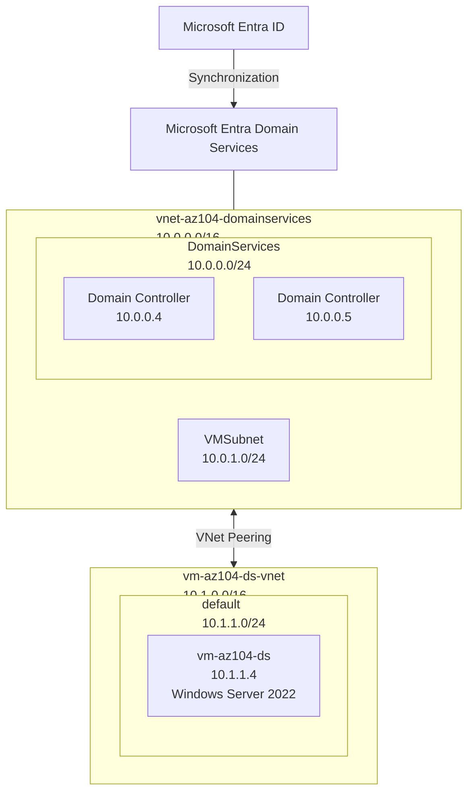

# Microsoft Entra Domain Services — Hands-on Lab

## Overview

🇺🇸 This project documents a hands-on lab in which I configured Microsoft Entra Domain Services and integrated it with an Azure virtual network and a Windows Server virtual machine.

🇯🇵 このプロジェクトでは、Microsoft Entra Domain Services を構成し、Azure 仮想ネットワークおよび Windows Server 仮想マシンと統合した実践的なラボについて記録しています。

## Objectives

🇺🇸
1. Configure Microsoft Entra Domain Services.
2. Configure an Azure virtual network and DNS settings for Microsoft Entra Domain Services.
3. Create a cloud-only Microsoft Entra user and configure the required group membership.
4. Deploy a Windows Server virtual machine and join it to the managed domain.
5. Configure and verify VNet peering between the VM network and the Domain Services network.
6. Validate DNS resolution, network connectivity, and domain membership.
7. Practice troubleshooting Azure identity, networking, DNS, and domain-join issues.

🇯🇵
1. Microsoft Entra Domain Services を構成する。
2. Microsoft Entra Domain Services 用の Azure 仮想ネットワークと DNS 設定を構成する。
3. クラウド専用の Microsoft Entra ユーザーを作成し、必要なグループメンバーシップを設定する。
4. Windows Server 仮想マシンをデプロイし、マネージド ドメインに参加させる。
5. 仮想マシンのネットワークと Domain Services のネットワーク間で VNet ピアリングを構成・確認する。
6. DNS 名前解決、ネットワーク接続、ドメイン参加を検証する。
7. Azure の ID、ネットワーク、DNS、ドメイン参加に関する問題のトラブルシューティングを実践する。

## Environment

🇺🇸 The lab was built using the following Azure resources and configuration:

| Component | Configuration |
|---|---|
| Microsoft Entra Domain Services | `<managed-domain>.onmicrosoft.com` |
| Domain Services region | Japan West |
| Domain Services VNet | `vnet-az104-domainservices` |
| Domain Services VNet address space | `10.0.0.0/16` |
| Domain Services subnet | `DomainServices` — `10.0.0.0/24` |
| VM subnet | `VMSubnet` — `10.0.1.0/24` |
| Domain controller IPs | `10.0.0.5`, `10.0.0.4` |
| VM | `vm-az104-ds` |
| VM region | Japan East |
| VM VNet | `vm-az104-ds-vnet` |
| VM VNet address space | `10.1.0.0/16` |
| VM subnet | `default` — `10.1.1.0/24` |
| VM private IP | `10.1.1.4` |
| VM operating system | Windows Server 2022 Datacenter: Azure Edition |
| VM size | `Standard_B2ats_v2` |

🇯🇵 このラボでは、以下の Azure リソースと構成を使用しました。

| コンポーネント | 構成 |
|---|---|
| Microsoft Entra Domain Services | `giuseppettn.onmicrosoft.com` |
| Domain Services のリージョン | Japan West |
| Domain Services VNet | `vnet-az104-domainservices` |
| Domain Services VNet アドレス空間 | `10.0.0.0/16` |
| Domain Services サブネット | `DomainServices` — `10.0.0.0/24` |
| VM サブネット | `VMSubnet` — `10.0.1.0/24` |
| ドメイン コントローラー IP | `10.0.0.5`, `10.0.0.4` |
| VM | `vm-az104-ds` |
| VM のリージョン | Japan East |
| VM VNet | `vm-az104-ds-vnet` |
| VM VNet アドレス空間 | `10.1.0.0/16` |
| VM サブネット | `default` — `10.1.1.0/24` |
| VM プライベート IP | `10.1.1.4` |
| VM OS | Windows Server 2022 Datacenter: Azure Edition |
| VM サイズ | `Standard_B2ats_v2` |

### Subnet Naming Note

🇺🇸 The VM subnet is named `default` in the current Azure environment.

I originally intended to rename it from `default` to `VMSubnet` to keep the subnet naming consistent with the Domain Services VNet. However, changing a subnet name requires creating a new subnet and moving the VM network interface, which would introduce unnecessary changes to the working environment.

Since this lab was built using Microsoft Azure credits for hands-on study and the current credit period is approaching its expiration date, I decided to leave the subnet name as `default` for now rather than make additional infrastructure changes.

🇯🇵 現在の Azure 環境では、VM のサブネット名は `default` となっています。

当初は、Domain Services VNet とサブネット名を統一するため、`default` から `VMSubnet` へ変更する予定でした。しかし、サブネット名を変更するには新しいサブネットを作成し、VM のネットワーク インターフェースを移動する必要があり、現在正常に動作している環境に不要な変更を加えることになります。

このラボでは Microsoft Azure のクレジットを使用して実践的な学習を行っており、現在のクレジット期間も終了間近であるため、追加のインフラ変更は行わず、今回はサブネット名を `default` のままにすることにしました。

## Architecture

🇺🇸 The following diagram represents the actual Azure infrastructure created and validated during this hands-on lab.

**Key points**

* `vnet-az104-domainservices` contains the Microsoft Entra Domain Services infrastructure.
* The `DomainServices` subnet contains the two domain controller IP addresses: `10.0.0.4` and `10.0.0.5`.
* The same VNet also contains the `VMSubnet` subnet.
* `vm-az104-ds-vnet` is a separate VNet (Virtual Network — rete virtuale Azure) containing the Windows Server VM.
* The VM is located in the `default` subnet (`10.1.1.0/24`).
* The two VNets are connected through VNet Peering (Virtual Network Peering — collegamento privato tra reti virtuali Azure).
* The VM uses the Domain Services DNS (Domain Name System — sistema che risolve i nomi in indirizzi IP) servers through the configured VNet DNS settings.
* The VM was successfully joined to Microsoft Entra Domain Services.

🇯🇵 以下の図は、このハンズオン ラボで実際に構築・検証した Azure インフラストラクチャを示しています。

**主なポイント**

* `vnet-az104-domainservices` に Microsoft Entra Domain Services の環境を構成しました。
* `DomainServices` サブネットには、2 台のドメイン コントローラーの IP アドレス `10.0.0.4` と `10.0.0.5` が使用されています。
* 同じ VNet（Virtual Network — Azure の仮想ネットワーク）内に `VMSubnet` サブネットも構成されています。
* `vm-az104-ds-vnet` は、Windows Server VM を配置した別の VNet です。
* VM は `default` サブネット（`10.1.1.0/24`）に配置されています。
* 2 つの VNet は VNet Peering（Virtual Network Peering — Azure の仮想ネットワーク間を接続する仕組み）によって接続されています。
* VM では、VNet に設定した DNS（Domain Name System — ドメイン名を IP アドレスに変換する仕組み）サーバーを使用しています。
* VM が Microsoft Entra Domain Services へのドメイン参加に成功したことを確認しました。

