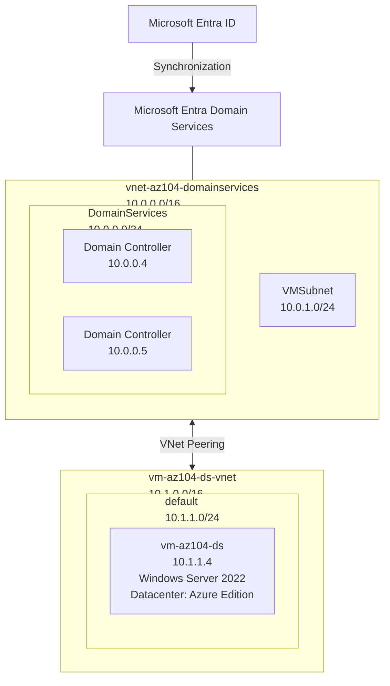

# Microsoft Entra Domain Services — Hands-on Lab

## Overview

🇺🇸 This project documents a hands-on lab in which I configured Microsoft Entra Domain Services and integrated it with an Azure virtual network and a Windows Server virtual machine.

🇯🇵 このプロジェクトでは、Microsoft Entra Domain Services を構成し、Azure 仮想ネットワークおよび Windows Server 仮想マシンと統合した実践的なラボについて記録しています。

---

## Objectives

🇺🇸

1. Configure Microsoft Entra Domain Services.
2. Configure an Azure virtual network and DNS settings for Microsoft Entra Domain Services.
3. Create a cloud-only Microsoft Entra user and configure the required group membership.
4. Deploy a Windows Server virtual machine and join it to the managed domain.
5. Configure and verify VNet peering between the VM network and the Domain Services network.
6. Validate DNS resolution, network connectivity, and domain membership.
7. Practice troubleshooting Azure identity, networking, DNS, and domain-join issues.

🇯🇵

1. Microsoft Entra Domain Services を構成する。
2. Microsoft Entra Domain Services 用の Azure 仮想ネットワークと DNS 設定を構成する。
3. クラウド専用の Microsoft Entra ユーザーを作成し、必要なグループメンバーシップを設定する。
4. Windows Server 仮想マシンをデプロイし、マネージド ドメインに参加させる。
5. 仮想マシンのネットワークと Domain Services のネットワーク間で VNet ピアリングを構成・確認する。
6. DNS 名前解決、ネットワーク接続、ドメイン参加を検証する。
7. Azure の ID、ネットワーク、DNS、ドメイン参加に関する問題のトラブルシューティングを実践する。

---

## Environment

🇺🇸 The lab was built using the following Azure resources and configuration:

| Component                          | Configuration                                 |
| ---------------------------------- | --------------------------------------------- |
| Microsoft Entra Domain Services    | `giuseppettn.onmicrosoft.com`                 |
| Domain Services region             | Japan West                                    |
| Domain Services VNet               | `vnet-az104-domainservices`                   |
| Domain Services VNet address space | `10.0.0.0/16`                                 |
| Domain Services subnet             | `DomainServices` — `10.0.0.0/24`              |
| Additional subnet                  | `VMSubnet` — `10.0.1.0/24`                    |
| Domain controller IPs              | `10.0.0.5`, `10.0.0.4`                        |
| VM                                 | `vm-az104-ds`                                 |
| VM region                          | Japan East                                    |
| VM VNet                            | `vm-az104-ds-vnet`                            |
| VM VNet address space              | `10.1.0.0/16`                                 |
| VM subnet                          | `default` — `10.1.1.0/24`                     |
| VM private IP                      | `10.1.1.4`                                    |
| VM operating system                | Windows Server 2022 Datacenter: Azure Edition |
| VM size                            | `Standard_B2ats_v2`                           |

🇯🇵 このラボでは、以下の Azure リソースと構成を使用しました。

| コンポーネント                         | 構成                                            |
| ------------------------------- | --------------------------------------------- |
| Microsoft Entra Domain Services | `giuseppettn.onmicrosoft.com`                 |
| Domain Services のリージョン          | Japan West                                    |
| Domain Services VNet            | `vnet-az104-domainservices`                   |
| Domain Services VNet アドレス空間     | `10.0.0.0/16`                                 |
| Domain Services サブネット           | `DomainServices` — `10.0.0.0/24`              |
| 追加サブネット                         | `VMSubnet` — `10.0.1.0/24`                    |
| ドメイン コントローラー IP                 | `10.0.0.5`, `10.0.0.4`                        |
| VM                              | `vm-az104-ds`                                 |
| VM のリージョン                       | Japan East                                    |
| VM VNet                         | `vm-az104-ds-vnet`                            |
| VM VNet アドレス空間                  | `10.1.0.0/16`                                 |
| VM サブネット                        | `default` — `10.1.1.0/24`                     |
| VM プライベート IP                    | `10.1.1.4`                                    |
| VM OS                           | Windows Server 2022 Datacenter: Azure Edition |
| VM サイズ                          | `Standard_B2ats_v2`                           |

### Subnet Naming Note

🇺🇸 The VM subnet in `vm-az104-ds-vnet` is named `default`.

The `vnet-az104-domainservices` VNet also contains a separate `VMSubnet` (`10.0.1.0/24`) subnet. This subnet was retained as part of the Domain Services network configuration, while the actual Windows Server VM was deployed in the separate `vm-az104-ds-vnet` VNet.

The VM subnet was originally intended to be renamed from `default` to `VMSubnet` for naming consistency. However, changing a subnet name would require additional infrastructure changes, so the working environment was left unchanged.

🇯🇵 `vm-az104-ds-vnet` の VM サブネット名は `default` です。

`vnet-az104-domainservices` VNet には、別途 `VMSubnet`（`10.0.1.0/24`）サブネットも構成されています。このサブネットは Domain Services 側のネットワーク構成の一部として維持され、実際の Windows Server VM は別の `vm-az104-ds-vnet` VNet にデプロイされています。

VM 側のサブネット名は、当初 `default` から `VMSubnet` に変更して命名を統一する予定でした。しかし、サブネット名の変更には追加のインフラ変更が必要になるため、現在正常に動作している環境を変更せず、`default` のまま維持しました。

---

## Architecture

🇺🇸 The following diagram represents the Azure infrastructure created and validated during this hands-on lab.


```mermaid
flowchart TB

    EntraID["Microsoft Entra ID"]
    AADDS["Microsoft Entra Domain Services"]

    EntraID -->|"Synchronization"| AADDS

    subgraph DS_VNET["vnet-az104-domainservices<br/>10.0.0.0/16"]
        direction TB

        subgraph DS_SUBNET["DomainServices<br/>10.0.0.0/24"]
            direction LR
            DC1["Domain Controller<br/>10.0.0.4"]
            DC2["Domain Controller<br/>10.0.0.5"]
        end

        VM_SUBNET["VMSubnet<br/>10.0.1.0/24"]
    end

    AADDS --- DS_VNET

    subgraph VM_VNET["vm-az104-ds-vnet<br/>10.1.0.0/16"]
        subgraph DEFAULT_SUBNET["default<br/>10.1.1.0/24"]
            VM["vm-az104-ds<br/>10.1.1.4<br/>Windows Server 2022<br/>Datacenter: Azure Edition"]
        end
    end

    DS_VNET <-->|"VNet Peering"| VM_VNET
```

### Key Points

🇺🇸

* `vnet-az104-domainservices` contains the Microsoft Entra Domain Services environment.
* The `DomainServices` subnet contains the two domain controller IP addresses: `10.0.0.4` and `10.0.0.5`.
* The same VNet contains the separate `VMSubnet` subnet (`10.0.1.0/24`).
* `vm-az104-ds-vnet` is a separate VNet containing the Windows Server VM.
* The VM is located in the `default` subnet (`10.1.1.0/24`).
* The two VNets are connected through VNet Peering.
* The VM uses the Domain Services DNS servers through the configured VNet DNS settings.
* The VM was successfully joined to the managed domain.

🇯🇵

* `vnet-az104-domainservices` に Microsoft Entra Domain Services の環境を構成しました。
* `DomainServices` サブネットには、2 台のドメイン コントローラーの IP アドレス `10.0.0.4` と `10.0.0.5` が使用されています。
* 同じ VNet 内に `VMSubnet`（`10.0.1.0/24`）サブネットも構成されています。
* `vm-az104-ds-vnet` は Windows Server VM を配置した別の VNet です。
* VM は `default` サブネット（`10.1.1.0/24`）に配置されています。
* 2 つの VNet は VNet Peering によって接続されています。
* VM は、構成された VNet DNS 設定を通じて Domain Services の DNS サーバーを使用しています。
* VM がマネージド ドメインへのドメイン参加に成功したことを確認しました。

---

## Implementation

### 1. Microsoft Entra Domain Services

🇺🇸 Microsoft Entra Domain Services was deployed in the Japan West region using the managed domain:

`giuseppettn.onmicrosoft.com`

The managed domain provides domain services such as domain join, LDAP-compatible directory services, authentication, and DNS for the lab environment.

🇯🇵 Japan West リージョンに Microsoft Entra Domain Services をデプロイし、以下のマネージド ドメインを使用しました。

`giuseppettn.onmicrosoft.com`

マネージド ドメインによって、ドメイン参加、LDAP 互換ディレクトリ サービス、認証、DNS など、このラボに必要なドメイン機能を提供しています。

### 2. Virtual Network and DNS

🇺🇸 The Domain Services environment was deployed into:

`vnet-az104-domainservices`

with address space:

`10.0.0.0/16`

The `DomainServices` subnet uses:

`10.0.0.0/24`

and the additional `VMSubnet` uses:

`10.0.1.0/24`

The VM was placed in a separate VNet:

`vm-az104-ds-vnet`

with address space:

`10.1.0.0/16`.

🇯🇵 Domain Services 環境は以下の VNet に構成しました。

`vnet-az104-domainservices`

アドレス空間:

`10.0.0.0/16`

`DomainServices` サブネット:

`10.0.0.0/24`

`VMSubnet`:

`10.0.1.0/24`

VM は別の VNet である `vm-az104-ds-vnet` に配置し、アドレス空間として `10.1.0.0/16` を使用しました。

### 3. Windows Server Virtual Machine

🇺🇸 A Windows Server 2022 Datacenter: Azure Edition VM was deployed as:

`vm-az104-ds`

The VM uses:

* Region: Japan East
* Size: `Standard_B2ats_v2`
* VNet: `vm-az104-ds-vnet`
* Subnet: `default`
* Private IP: `10.1.1.4`

The VM does not use a public IP address.

🇯🇵 Windows Server 2022 Datacenter: Azure Edition の VM を以下の構成でデプロイしました。

* リージョン: Japan East
* サイズ: `Standard_B2ats_v2`
* VNet: `vm-az104-ds-vnet`
* サブネット: `default`
* プライベート IP: `10.1.1.4`

この VM にはパブリック IP アドレスを割り当てていません。

### 4. VNet Peering

🇺🇸 The Domain Services VNet and the VM VNet were connected using VNet Peering.

This allows the VM in `vm-az104-ds-vnet` to communicate privately with the Domain Services infrastructure in `vnet-az104-domainservices`.

🇯🇵 Domain Services VNet と VM VNet の間に VNet Peering を構成しました。

これにより、`vm-az104-ds-vnet` に配置した VM から `vnet-az104-domainservices` の Domain Services 環境へプライベート ネットワーク経由で通信できる構成にしています。

---

## Validation

### Domain Join

🇺🇸 The Windows Server VM was successfully joined to the managed domain.

The validation command returned:

```text
PartOfDomain : True
```

This confirms that the VM is a member of the configured domain.

🇯🇵 Windows Server VM がマネージド ドメインへの参加に成功したことを確認しました。

検証結果:

```text
PartOfDomain : True
```

これにより、VM が構成したドメインのメンバーになっていることを確認できます。

### DNS Resolution

🇺🇸 DNS resolution from the VM successfully resolved the managed domain to both Domain Services domain controller IP addresses:

```text
Name:      giuseppettn.onmicrosoft.com
Addresses: 10.0.0.5
           10.0.0.4
```

This confirms that the VM can resolve the managed domain using the Domain Services DNS infrastructure.

🇯🇵 VM からマネージド ドメインの DNS 名前解決を実行し、2 台の Domain Services ドメイン コントローラーの IP アドレスが返されることを確認しました。

```text
Name:      giuseppettn.onmicrosoft.com
Addresses: 10.0.0.5
           10.0.0.4
```

これにより、VM が Domain Services の DNS インフラストラクチャを使用してマネージド ドメインを名前解決できることを確認しました。

### DNS Connectivity

🇺🇸 TCP connectivity to DNS port 53 was tested against both domain controller IP addresses.

Results:

```text
10.0.0.4 → TcpTestSucceeded : True
10.0.0.5 → TcpTestSucceeded : True
```

The VM therefore successfully reached both Domain Services DNS endpoints over TCP port 53 during validation.

🇯🇵 2 台のドメイン コントローラーに対して、DNS で使用される TCP ポート 53 への接続を検証しました。

結果:

```text
10.0.0.4 → TcpTestSucceeded : True
10.0.0.5 → TcpTestSucceeded : True
```

検証時点で、VM から両方の Domain Services DNS エンドポイントへ TCP 53 番ポートで接続できることを確認しました。

---

## Screenshots

🇺🇸 The `screenshots/` directory contains the screenshots captured during the configuration and validation of this lab.

They document the Azure resources, Domain Services configuration, networking, VM configuration, peering, domain join, and validation results.

🇯🇵 `screenshots/` ディレクトリには、このラボの構築・設定・検証時に取得したスクリーンショットを保存しています。

Azure リソース、Domain Services の構成、ネットワーク、VM 設定、VNet Peering、ドメイン参加、および検証結果を記録しています。

---

## Security Considerations

🇺🇸 This is a hands-on learning environment rather than a production deployment.

Some configuration choices were made specifically to simplify laboratory setup and troubleshooting. For example, the lab includes an RDP rule allowing TCP port 3389 from `Any` to `Any`.

The VM does not have a public IP address, so this rule does not by itself expose the VM directly to the public Internet. Nevertheless, such a permissive rule should not be treated as a recommended production security configuration.

Other infrastructure identifiers, including tenant/domain information, private IP addresses, hostnames, and Azure resource identifiers, are intentionally visible in this portfolio to document the actual environment used for the lab.

No passwords, access tokens, private keys, or other authentication secrets are included.

🇯🇵 この環境は本番環境ではなく、Azure の実践的な学習を目的としたラボ環境です。

一部の設定は、ラボ環境の構築やトラブルシューティングを簡単にするために構成しています。例えば、TCP 3389 番ポートの RDP ルールでは、`Any` から `Any` への通信を許可しています。

VM にはパブリック IP アドレスを割り当てていないため、このルールだけで VM が直接パブリック インターネットへ公開されるわけではありません。ただし、このような広い許可範囲のルールは、本番環境で推奨されるセキュリティ構成として扱うべきものではありません。

テナント／ドメイン情報、プライベート IP アドレス、ホスト名、Azure リソース ID などのインフラ識別情報は、実際に使用したラボ環境を記録する目的で、このポートフォリオでは意図的に表示しています。

パスワード、アクセストークン、秘密鍵、その他の認証用シークレットは含めていません。

---

## Key Takeaways

🇺🇸 This lab provided hands-on practice with:

* Microsoft Entra Domain Services
* Microsoft Entra ID integration
* Azure Virtual Networks and subnets
* VNet Peering
* Azure VM deployment
* DNS configuration and troubleshooting
* Windows Server domain joining
* Network connectivity validation
* Basic Azure identity and networking troubleshooting

The lab demonstrates the complete path from managed identity infrastructure and networking configuration to a successful Windows Server domain join and post-configuration validation.

🇯🇵 このラボを通じて、以下の Azure 技術を実践的に学習しました。

* Microsoft Entra Domain Services
* Microsoft Entra ID との統合
* Azure Virtual Network とサブネット
* VNet Peering
* Azure VM のデプロイ
* DNS の構成とトラブルシューティング
* Windows Server のドメイン参加
* ネットワーク接続の検証
* Azure の ID およびネットワークに関する基本的なトラブルシューティング

マネージド ID インフラストラクチャとネットワーク構成から、Windows Server のドメイン参加、さらに構成後の検証まで、一連の流れを実際に構築・確認したラボです。
